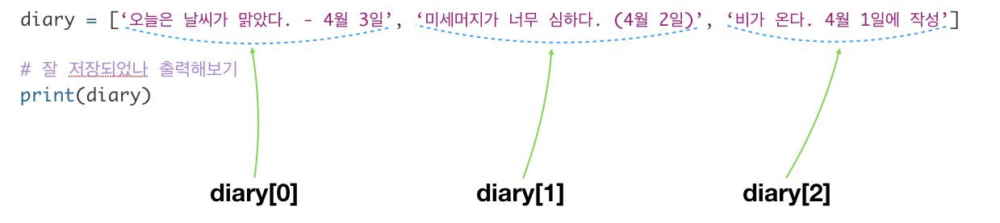

# Stage 2 - 이미지, 폼을 다루는 HTML tag를 배워보자

## 이미지, form 관련 태그 4종

| **태그** | **설명** | **사용 예** |
| --- | --- | --- | --- | --- |
| img |  |  |
| div |  |  |
| input |  |  |
| textarea |  |  |

### 태그들의 속성

태그에는 속성이 있습니다. 이미지를 넣는데, 그 이미지의 가로랑 세로 크기 정도는 정하고 싶을거 아니예요? 로그인 창의 아이디 입력필드에 '아이디를 입력해주세요'라는 힌트 글자를 넣어둘 수도 있겠죠. 이렇게 태그를 좀더 세밀하게 조정할 수 있는 기능이 속성입니다.

| **태그** | **속** | **설명** | **사용**  |
| --- | --- | --- | --- | --- | --- | --- |
| input | type |  |  |
|  | value |  |  |
|  | readonly |  |  |
| textarea | rows |  |  |
|  | cols |  |  |
| img | width, height |  |  |


**속성과 css의 차이**

html이 요소를 결정하고 css가 크기, 모양 색 등을 결정한다고 했는데, 크기를 결정하는 html 속성이 있다는 말이 헷갈리지 않나요?

img 태그의 경우 width, height라는 가로와 세로 길이를 설정하는 속성을 사용할 수 있습니다. 이 속성을 사용하지 않아도 앞으로 배울 style을 사용하면, 마찬가지로 가로와 세로 길이를 설정할 수 있죠. 즉 모양과 크기를 결정하는 일부분은 속성으로 대체할 수 있는 부분도 있긴 합니다. 다만 그 사용이 제한되어 있어서 세밀한 디자인은 css를 통해야만 가능한거죠.


## 실습

아래 내용을 직접 타이핑해보고 또 변경해보면서 결과를 확인해봅시다.

```text
26페이지 코드
```




